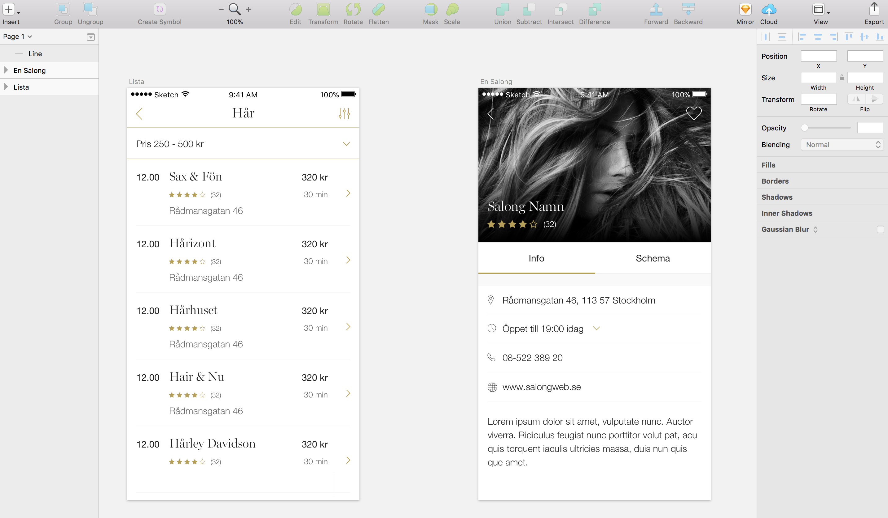

# skbv_arbetsprov
   
The application has been deployed at https://skbv-a03b9.firebaseapp.com/     

## Technical highlight
- This application has been created with React.js using `create-react-app`
     
- This Single Page Application uses `React Router v4`. Router is useful when users use the back button of the browser, instead of the one on the application page. The page will behave as users expect thanks to Router.     
      
- The application imports a salon component dynamically (which is the second view) with the help of `React-loadable`, and it helps to reduce the initial loading-time and an unecessary data-loading to mobile devices. As a result, it should enhance user experience of mobile devices.
      
- I personaly like this CSS-in-JS library, `styled-components`, because it allows me to use usual CSS syntax as well as Sass syntax. Able to send properties makes it possible to change styles dynamically as well. It is also easy to use with React applications.
     
- Static data for this app is saved as a JSON file (`./src/components/db.json`).
     
## Installation
```sh
  git clone https://github.com/YAOrangeTime16/skbv_arbetsprov.git
  cd skbv_arbetsprov
```
then install packages;
     
```sh
  npm install
  # or
  yarn
```
to start the app locally;
   
```sh
  npm start
  # or
  yarn start
```
## Technologies & Tools
### Library & packages
* [React](https://reactjs.org/)
* [create-react-app](https://github.com/facebookincubator/create-react-app)
* [react-router-dom](https://www.npmjs.com/package/react-router-dom)
* [rect-loadable](https://github.com/jamiebuilds/react-loadable)
* [prop-types](https://www.npmjs.com/package/prop-types)
* [styled-components](https://www.styled-components.com/)
* [firebase Hosting](https://firebase.google.com/products/hosting/)

### Other tools
* [Sketch](https://www.sketchapp.com/)
* [Zeplin](https://zeplin.io/)
* [Visual Studio Code](https://code.visualstudio.com/)
* [IconFinder](https://www.iconfinder.com/)
* [JSONLint](https://jsonlint.com/)

## Original Design
